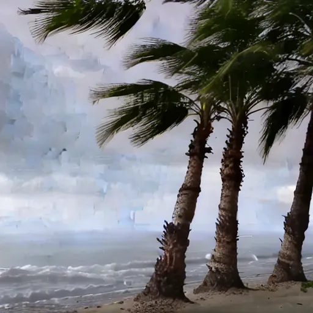
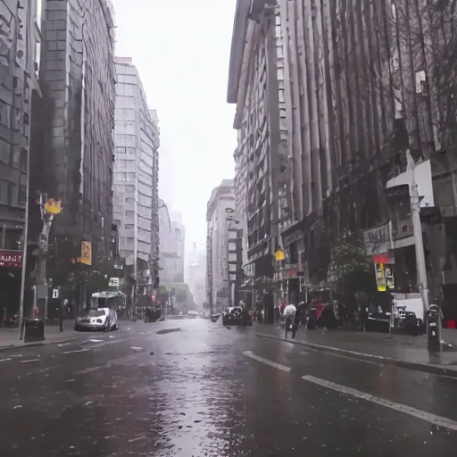
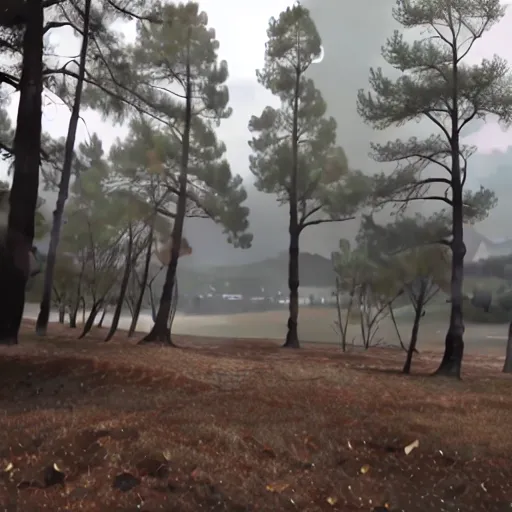
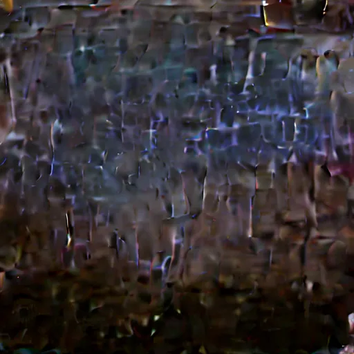

# CLAP2Diffusion: Hierarchical Audio-to-Image Generation

**KUBIG Contest**  
📄 **[Project Presentation (PDF)](assets/KUBIG_CV4.pdf)**
<div align="center">
  
| 🎵 Thunder.wav + "a beach" | 🎵 Thunder.wav + "a city" |
|:---:|:---:|
|  |  |

**Generate various scenes with the same audio and text**

</div>

## Overview

**Input**: Audio file (.wav) + Text prompt  
**Output**: 512x512 image

CLAP2Diffusion is a model that generates images from audio and text inputs. By applying 3-stage hierarchical decomposition and Norm 60 optimization to the SonicDiffusion architecture, it visually transforms audio characteristics.

## Key Features

- **Hierarchical Audio Processing**: 3-stage decomposition into foreground/background/atmosphere
- **Norm 60 Optimization**: Experimentally discovered optimal normalization value
- **Temperature Annealing**: Progressive improvement from 2.0 → 0.5
- **4x Self-Attention**: Enhanced audio token generation

## Dataset

**AudioCaps**: Audio-text paired dataset extracted from YouTube videos
- Includes various everyday sounds and environmental audio
- Provides natural language captions for each audio
- Train/Val/Test splits for training and evaluation

## Results

### Success Cases

Transforming thunder sound into various scenes:

🔊 **Audio Playback**: [Thunder.wav](assets/Thunder.wav)

<details>
<summary>Audio Player (Click to play)</summary>

https://github.com/[username]/[repo]/assets/Thunder.wav

</details>

| Audio | Text Prompt | Generated Image |
|--------|------------|-----------------|
| Thunder.wav | "a beach" |  |
| Thunder.wav | "a city" |  |
| Thunder.wav | "a forest" |  |

### Failure Cases

Human voices (laughter, etc.) are not properly generated:

🔊 **Audio Samples**: [laughing_baby.wav](assets/laughing_baby.wav) | [laughing_man.wav](assets/laughing_man.wav)

| Audio | Text Prompt | Issue | Failed Result |
|--------|-------------|-------|---------------|
| laughing_baby.wav | "a city" | Incorrect scene generation |  |
| laughing_man.wav | "a beach" | Audio-visual alignment failure |  |
| Thunder.wav | (No text) | Only abstract patterns generated |  |

## Model Architecture

- **Audio Projector**: 2.2M parameters
- **Hierarchical Decomposer**: 0.3M parameters  
- **Inference Speed**: ~2 seconds/image (with GPU)
- **Memory**: ~6GB VRAM

## Checkpoints

Pre-trained models included in `checkpoints/` folder:
- `audio_projector_stage1.pth`: Stage 1 model
- `audio_projector_stage2.pth`: Stage 2 model
- `audio_projector_stage3_finetuned.pth`: Final model

## Installation and Execution

### Using Docker (Recommended)

```bash
docker-compose up --build
```

### Manual Installation

```bash
conda create -n clap2diffusion python=3.10
conda activate clap2diffusion
pip install -r requirements.txt
python app/gradio_app.py
```

## Training Stages

```bash
# Stage 1: Audio Projector (3,000 steps)
python scripts/train_stage1.py

# Stage 2: Full model (2,000 steps)
python scripts/train_stage2.py

# Stage 3: Fine-tuning (1,000 steps)
python scripts/train_stage3.py
```

## License

MIT License

## References

- **SonicDiffusion** (2023): "SonicDiffusion: Audio-Driven Image Generation and Editing with Pretrained Diffusion Models"
- **AudioLDM 2** (2023): "AudioLDM 2: Learning Holistic Audio Generation with Self-supervised Pretraining"
- **CLAP** (2023): "Large-scale Contrastive Language-Audio Pre-training with Feature Fusion and Keyword-to-Caption Augmentation"
- **Stable Diffusion** (2022): "High-Resolution Image Synthesis with Latent Diffusion Models"
- **AudioCaps** (2019): "AudioCaps: Generating Captions for Audios in The Wild"

---
